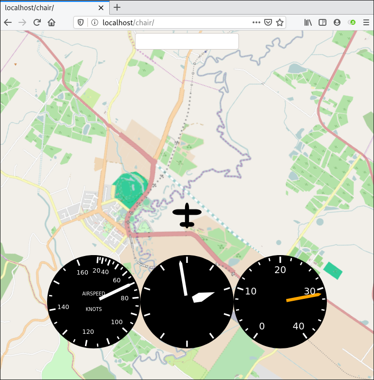

Chairflyer - The 2 and a half D flight simulator
================================================

Chairflyer is an experiment in creating the minimal necessary flight
simulation experience for practicing situational awareness in
preference to manipulation of flight controls. It implements a
simulation of an aircraft's flight profile (vertical and horizontal
trajectory) and evolves it over a great circle which can be updated on
the fly. It's more than 2D but not fully 3D.

Chairflyer is completely experimental.
There are many FIXMEs. There are many bugs.

There are two components. A server which runs the simulation and a web
client that provides visualization & controls. They speak together
over a websocket.

Index
-----

- `lib` - simulation code
- `test` - simulation tests & plotting
- `web` - static HTML resources
- `webserv` - server which listens for websocket connections
- `handy` - some Haskell for generating SVG data

Instructions
------------

1. Point a web server at `web`
2. Run the simulation server `stack run webserv`, it should fire up on port 8000
3. Open your browser and locate your web server, eg: `http://localhost`
4. If all goes according to plan you'll see a little plane waiting to takeoff at Lilydale

Controls
--------

- w, s - increase & decrease throttle
- arrow left/right - steer left & right
- arrow up/down - pitch up/down
- space - peek at instruments

There's also an input box which allows you to manually send commands
over the websocket.

Future work
-----------

The dream is to be able to use this for practicing dead-reckoning
navigation. Steps on the way:

- simple weather model so that you get blown off course
- magnetic compass
- varying magnetic field to influence the compass
- map display that does not give away the direction of true north

I'm also not totally happy with the web interface, the map is slow &
clunky. A native GL interface which pulls down satellite imagery tiles
would be awesome.
